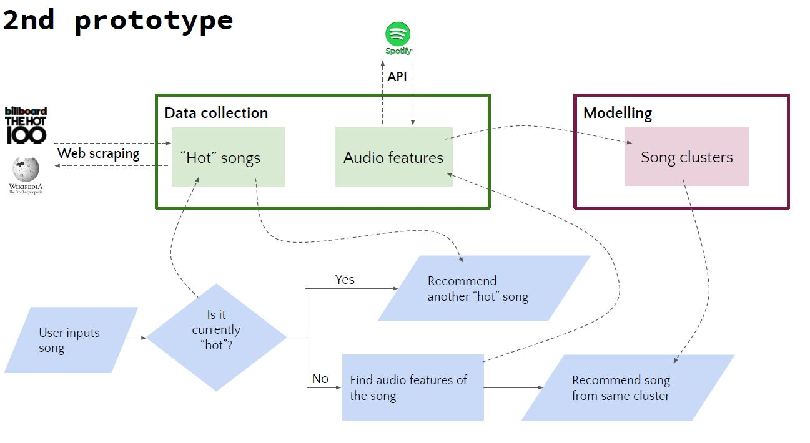
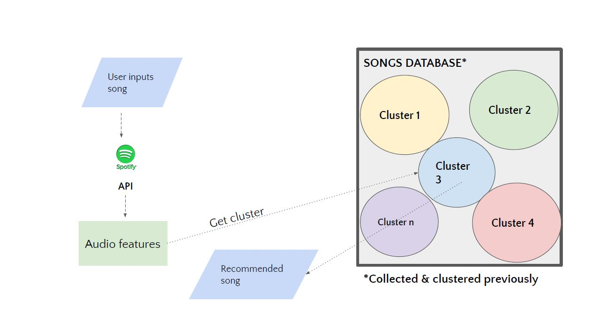

Lab | GNOD Project

This project is a Spotify song recommender. 

I made a pipeline to:

ask the user to input a song and artist, then check whether or not the song is in the Top 100 Songs.
if the song is in the Top 100 Songs list, then return a random song from that list.                         
                         
                         
if the song is not in the Top 100 Songs list:

collect the audio features from the Spotify API. Send the Spotify audio features of the submitted song to the clustering model.
Compare song to closest cluster, then pick a random song from the closest cluster. Finally, return the recommended song back to the user.

Images:

